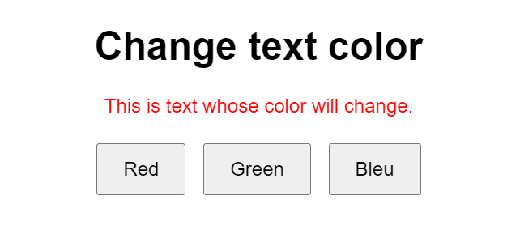

# Text-Color-Changer-with-jQuery

## Description
This is a simple web page designed to demonstrate how to change the color of a text element using jQuery. The page features a heading, a paragraph of text, and three buttons. Each button, when clicked, changes the color of the text to either red, green, or blue.

### Components:

1. **HTML Structure**:
    - **Heading**: A header (`<h1>`) titled "Changer la couleur du texte".
    - **Text Paragraph**: A paragraph (`
`) with an ID `#text` containing some sample text.
    - **Buttons**: Three buttons labeled "Rouge", "Vert", and "Bleu".

2. **CSS Styling**:
    - The page is styled with a simple and clean design using Arial font.
    - The buttons and text are centered on the page with some margin for spacing.

3. **JavaScript (jQuery)**:
    - **Document Ready**: Ensures the jQuery code runs only after the document is fully loaded.
    - **Button Click Events**: Each button has an associated click event handler that changes the color of the text.

### Features:
- **Interactive Elements**: Buttons that change the color of the text when clicked.
- **Dynamic Style Changes**: Utilizes jQuery to dynamically change the CSS properties of the text element.
- **User-Friendly Interface**: Simple and intuitive design with clear labels and spacing for easy interaction.

### Usage:
- **Red Button**: Changes the text color to red.
- **Green Button**: Changes the text color to green.
- **Blue Button**: Changes the text color to blue.

This example provides a straightforward and engaging way to demonstrate the use of jQuery for dynamic style changes in a web page.
